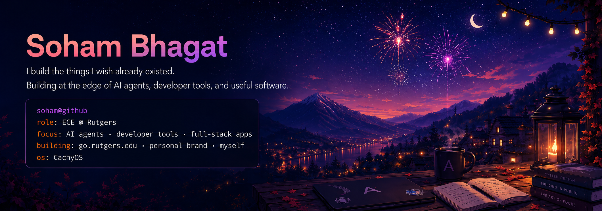

<p align="center">
  
</p>

# Soham Bhagat

## ~/about

I'm an Electrical & Computer Engineering student at Rutgers focused on AI engineering, full-stack apps, and developer tools.

Right now, I'm exploring the next layer of engineering: agents, tools, workflows, and systems that help developers build better software faster.

## ~/now

* exploring AI agents, coding harnesses, and agentic software development
* building tools that make engineering workflows faster without making them sloppier
* working with Linux, Docker, Next.js, Python, TypeScript, and Ai
* studying Electrical & Computer Engineering at Rutgers

## ~/featured

* **mkaireadme** — AI-powered CLI for generating polished README files
* **githubreadme.com** — tooling for building beautiful GitHub READMEs
* **Abacus** — calculator app and product experiments
* **Astatide API** — developer and network utility API

## ~/stack

```txt
systems:   Linux · Docker · Kubernetes · Cloudflare · AWS
frontend:  Next.js · React · Tailwind · TypeScript
backend:   Python · Flask · Node.js · PostgreSQL · MongoDB
ai/ml:     PyTorch · TensorFlow · Agents · LLMs
```

## ~/connect

* website: **portfolio.astatide.com**
* email: **[bhagatsoham14@gmail.com](mailto:bhagatsoham14@gmail.com)**
* github: **github.com/Githubfgtvf**

